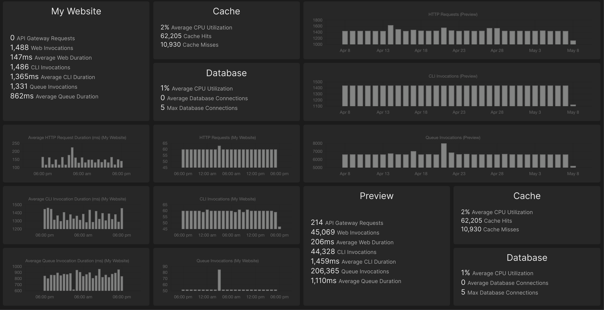

# Vapor Metrics Tile

[](https://packagist.org/packages/fidum/laravel-dashboard-vapor-metrics-tile)
[](https://github.com/fidum/laravel-dashboard-vapor-metrics-tile/actions?query=workflow%3Arun-tests+branch%3Amaster)
[](https://codecov.io/gh/fidum/laravel-dashboard-vapor-metrics-tile)
[](https://twitter.com/danmasonmp)  

Displays metrics for **all** of your laravel vapor projects - caches, databases and environment metrics and charts included! 



## Installation

You can install the package via composer:

```bash
composer require fidum/laravel-dashboard-vapor-metrics-tile
```

## Usage
In the `dashboard` config file, you must add this configuration in the `tiles` key. There are separate settings for 
`caches`, `databases` and `environments`.

```php
// in config/dashboard.php
return [
    // ...
    'tiles' => [
        'vapor_metrics' => [
            'secret' => env('VAPOR_API_TOKEN'), // optional: Uses `VAPOR_API_TOKEN` env by default
            'refresh_interval_in_seconds' => 300, // optional: Default: 300 seconds (5 minutes)
            'period' => '7d', // optional: 1m, 5m, 30m, 1h, 8h, 1d (default), 3d, 7d, 1M
            'caches' => [ // Leave empty if you don't want any cache tiles
                'My Cache Instance' => [ // Key will be used as the title of the displayed tile
                    'cache_id' => 222, // required: The id of your vapor cache instance
                    'period' => '7d', // optional: 1m, 5m, 30m, 1h, 8h, 1d (default), 3d, 7d, 1M
                    'refresh_interval_in_seconds' => 60, // optional: override individual tile
                    'secret' => null, // :optional: override individual tile
                ],
                'Another Cache' => ['cache_id' => 333]
            ],
            'databases' => [ // Leave empty if you don't want any database tiles
                'My Database' => [ // Key will be used as the title of the displayed tile
                    'database_id' => 555, // required: The id of your vapor database instance
                    'period' => '7d', // optional: 1m, 5m, 30m, 1h, 8h, 1d (default), 3d, 7d, 1M
                    'refresh_interval_in_seconds' => 60, // optional: override individual tile
                    'secret' => null, // :optional: override individual tile
                ],
                'Another Database' => ['database_id' => 444]
            ],
            'environments' => [ // Leave empty if you don't want any envrionment tiles
                'My Staging Website' => [ // Key will be used as the title of the displayed tile                
                    'project_id' => 1111, // required: The id of your vapor project
                    'environment' => 'staging', // optional: Defaults to 'production'
                    'period' => '7d', // optional: 1m, 5m, 30m, 1h, 8h, 1d (default), 3d, 7d, 1M
                    'refresh_interval_in_seconds' => 60, // optional: override individual tile
                    'secret' => null, // :optional: override individual tile
                ],
                'My Production Website' => ['project_id' => 1111],
            ],
        ],
    ],
];
```

In `app\Console\Kernel.php` you should schedule the below to run every `x` minutes. Only add the commands where you have configured the related tiles above. 

```php
// in app/console/Kernel.php
protected function schedule(Schedule $schedule)
{
    $schedule->command(\Fidum\VaporMetricsTile\Commands\FetchVaporCacheMetricsCommand::class)->everyThirtyMinutes();
    $schedule->command(\Fidum\VaporMetricsTile\Commands\FetchVaporDatabaseMetricsCommand::class)->everyThirtyMinutes();
    $schedule->command(\Fidum\VaporMetricsTile\Commands\FetchVaporEnvironmentMetricsCommand::class)->everyThirtyMinutes();
}
```

In your dashboard view you can use one or all or multiple of each of these components. The `tileName` and `position` 
attributes are **required**. The `tileName` attribute value needs to match the name specified in the config:

```blade
<x-dashboard>
    <livewire:vapor-environment-metrics-tile tileName="My Production Website" position="a1:a4" />
    <livewire:vapor-cache-metrics-tile tileName="My Cache Instance" position="b1:a2" />
    <livewire:vapor-database-metrics-tile tileName="My Database" position="b3:b4" />
    <livewire:vapor-environment-metrics-chart-tile type="http-requests-avg-duration" tileName="My Production Website" position="a5:a6" />
    <livewire:vapor-environment-metrics-chart-tile type="cli-avg-duration" tileName="My Production Website" position="a7:a8" />
    <livewire:vapor-environment-metrics-chart-tile type="queue-avg-duration" tileName="My Production Website" position="a9:a10" />
    <livewire:vapor-environment-metrics-chart-tile type="http-requests-total" tileName="My Production Website" position="b5:b6" />
    <livewire:vapor-environment-metrics-chart-tile type="cli-invocations-total" tileName="My Production Website" position="b7:b8" />
    <livewire:vapor-environment-metrics-chart-tile type="queue-invocations-total" tileName="My Production Website" position="b9:b10" />
</x-dashboard>
```

For charts an additional `type` value should be provided to select which chart to show:

- `cli-avg-duration`: Average CLI Invocation Duration (ms)
- `cli-invocations-total`: CLI Invocations
- `http-requests-avg-duration`: Average HTTP Request Duration (ms) 
- `http-requests-total`: HTTP Requests
- `queue-avg-duration`: Average Queue Invocation Duration (ms)
- `queue-invocations-total`: Queue Invocations

The charts use [fidum/laravel-dashboard-chart-tile](https://github.com/fidum/laravel-dashboard-chart-tile) internally. 
You can use the below additional properties for further customisation:
 
- `height` sets the height of the chart, depending on your dashboard layout you may need to adjust this (defaults to `100%`).
- `refreshIntervalInSeconds` use this to override the refresh rate of an individual tile (defaults to above configured setting) 

## Testing
```bash
composer test
```

## Changelog

Please see [CHANGELOG](CHANGELOG.md) for more information on what has changed recently.

## Contributing

Please see [CONTRIBUTING](CONTRIBUTING.md) for details.

## Security

If you discover any security related issues, please email :author_email instead of using the issue tracker.

## Credits

- [All Contributors](../../contributors)

## License

The MIT License (MIT). Please see [License File](LICENSE.md) for more information.
